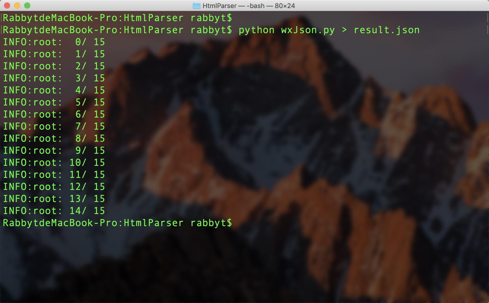

`wxJson.py`

测试小米所有（15个）网站：



结果(详见文件[result.json](./result.json))：

```json
[
  {
    "category_id": 8, 
    "h5_url": "https://i.mi.com/guide/zh-CN/note/overview", 
    "cpid": "auto_e19zniht4geblh5v0z", 
    "title": "小米云便签概览", 
    "mainbody": {
      "answer_content": "小米“便签”云同步功能，可以将您手机的“便签”数据安全存储至云端，并保持实时更新，随时随地实现多设备共享。在小米品牌手机、平板、网页版i.mi.com上，以及安装了云服务电脑端的电脑中，都可以通过小米云服务中的“便签”功能，查看和管理便签数据。【注】实现上述功能，需先确保已开启“便签”云同步。"
    }, 
    "update": 1, 
    "time_modify": null, 
    "page_type": 4, 
    "answer": {
      "answer_style": 2, 
      "long_answer": "小米“便签”云同步功能，可以将您手机的“便签”数据安全存储至云端，并保持实时更新，随时随地实现多设备共享。在小米品牌手机、平板、网页版i.mi.com上，以及安装了云服务电脑端的电脑中，都可以通过小米云服务中的“便签”功能，查看和管理便签数据。【注】实现上述功能，需先确保已开启“便签”云同步。"
    }, 
    "page_attribute": 1, 
    "content_id": "https://i.mi.com/guide/zh-CN/note/overview", 
    "@type": "wxsearch_cpdata", 
    "time_publish": null
  }, 
  ...
  ...
  ...
  {
    "category_id": 8, 
    "h5_url": "https://i.mi.com/guide/zh-CN/cloudspace/overview", 
    "cpid": "auto_e19zniht4geblh5v0z", 
    "title": "什么是小米云服务存储空间？", 
    "mainbody": {
      "answer_content": "首次激活小米云服务后，您会自动获得 5GB 的免费云存储空间。用于存储照片、联系人、便签、桌面备份等数据，并让您的数据在多设备间同步，保持最新。以下数据会占用您的云存储空间：桌面云备份，包括备份的桌面应用列表、桌面布局、系统设置各业务云同步数据，如相册照片、录音、便签等小米云盘存储的数据，包括自动备份的目录文档，如QQ、微信文档等云空间用满后，您的设备数据不会再同步到云空间，相关云服务同步备份功能将会暂停，如桌面云备份、相册、联系人等数据同步，小米云盘同步等都将停止服务。您可以随时 升级会员 获得更多云空间。开启云服务会员，您还可以 与家人共享您的云空间 。 了解更多会员方案 。您还可以通过删除已储存的数据，以释放更多云空间。【警告】删除已同步至云端的数据，您开启云同步的所有设备的数据也会被删除。"
    }, 
    "update": 1, 
    "time_modify": null, 
    "page_type": 4, 
    "answer": {
      "step_answer": [
        "桌面云备份，包括备份的桌面应用列表、桌面布局、系统设置", 
        "各业务云同步数据，如相册照片、录音、便签等", 
        "小米云盘存储的数据，包括自动备份的目录文档，如QQ、微信文档等", 
        "您可以随时 升级会员 获得更多云空间。开启云服务会员，您还可以 与家人共享您的云空间 。 了解更多会员方案 。", 
        "您还可以通过删除已储存的数据，以释放更多云空间。"
      ], 
      "step_answer_prefix": "step", 
      "answer_style": 3, 
      "intro_answer": "首次激活小米云服务后，您会自动获得 5GB 的免费云存储空间。用于存储照片、联系人、便签、桌面备份等数据，并让您的数据在多设备间同步，保持最新。以下数据会占用您的云存储空间：云空间用满后，您的设备数据不会再同步到云空间，相关云服务同步备份功能将会暂停，如桌面云备份、相册、联系人等数据同步，小米云盘同步等都将停止服务。【警告】删除已同步至云端的数据，您开启云同步的所有设备的数据也会被删除。"
    }, 
    "page_attribute": 1, 
    "content_id": "https://i.mi.com/guide/zh-CN/cloudspace/overview", 
    "@type": "wxsearch_cpdata", 
    "time_publish": null
  }
]

```
